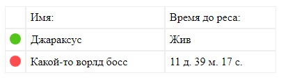
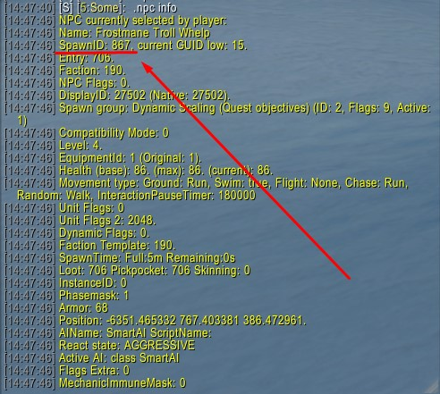

# Скрипт для отображения времени респауна мобов | Ворлд Боссов

## Для WoW 3.3.5a Trinity

Этот скрипт выводит информацию о времени респауна мобов и ворлд боссов, указанных в конфигурации.

**Полезен для серверов с собственными ворлд боссами**

## Установка

1. Скачайте архив по [ссылке](https://github.com/wowerdev/spawn-time/archive/refs/heads/main.zip).
2. Переместите папку `spawn-time` из архива в корень вашего сайта.
3. Настройте конфигурацию в `spawn-time/config.php` (стандартные настройки подключения к БД).
4. В конфигурации настройте массив `$spawn_mobs` для отображения нужных мобов. Чтобы получить GUID моба, возьмите его в цель в игре и введите команду `.npc info`. Найдите строку `spawnID` — это и есть GUID (не путайте с обычным ID). В некоторых версиях название поля может отличаться.
   
5. Подключите скрипт в нужном месте на сайте. Страница должна быть на `.php`, пример подключения: `<?php require './spawn-time/get-html-spawn.php'; ?>`

**Готово**

## Возможности

- Скрипт автоматически уменьшает счётчик на JavaScript без запросов к БД.
- Помимо HTML-вывода, можно получать данные в JSON и обрабатывать их самостоятельно. Для этого сделайте запрос к `spawn-time/get-json-spawn.php`.

## Примеры

В папке `example` есть примеры подключения к главной странице и внутренних страниц.

## Кастомизация стилей

- Таблица максимально без стилей, чтобы вписаться в любой сайт. Она унаследует стили шрифта вашего сайта. При необходимости стили можно кастомизировать в `spawn-time/get-html-spawn.php` в теге `<style>`. Отдельный файл не создавался для удобства интеграции.
